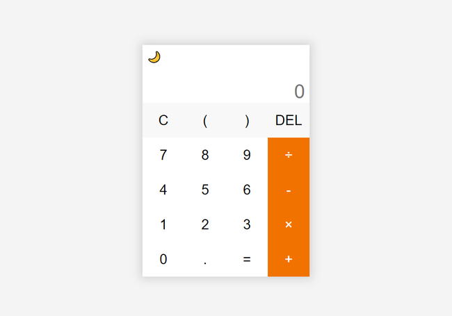

# Calculator

This is the simple calculator implementation on Vue 3.



**Note**: don't use this project for accurate calculations. I implemented this project to train my skills in UI programming on Vue 3. I didn't pay enough attention to the calculation function. So, this calculator implementation can make seriously  mistakes in calculations.

# Usage

Installs the project

```
git clone https://github.com/yurimikushov/calculator-on-vue.git
cd calculator-on-vue
npm i
```

Runs the app in `development` mode

```
npm run dev
```

Builds the app for `production` to the `dist` folder

```
npm run build
```

# License

The project is available under the [MIT License](LICENSE).